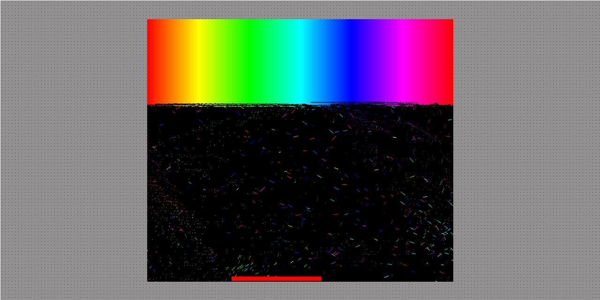

<!-- PROJECT SHIELDS -->
[![Contributors][contributors-shield]][contributors-url]
[![Forks][forks-shield]][forks-url]
[![Stargazers][stars-shield]][stars-url]
[![Issues][issues-shield]][issues-url]
[![MIT License][license-shield]][license-url]
[![LinkedIn][linkedin-shield]][linkedin-url]

<!-- PROJECT LOGO -->
<br />
<div align="center">
  <a href="https://github.com/daeddy/Rainbow-Block-Breaker">
    
  </a>

<h3 align="center">Rainbow Block Breaker</h3>
  <p align="center">
    Typescript implementation of a cool game I found a long time ago.
    <br />
    <a href="https://daeddy.github.io" target="_blank"><strong>Try it!</strong></a>
    <br />
    <br />
    <a href="https://github.com/daeddy/Rainbow-Block-Breaker/issues">Report Bug</a>
    ·
    <a href="https://github.com/daeddy/Rainbow-Block-Breaker/issues">Request Feature</a>
  </p>
</div>

<!-- TABLE OF CONTENTS -->
<details>
  <summary>Table of Contents</summary>
  <ol>
    <li>
      <a href="#about-the-project">About The Game</a>
      <ul>
        <li><a href="#built-with">Built With</a></li>
      </ul>
    </li>
    <li>
      <a href="#getting-started">Getting Started</a>
      <ul>
        <li><a href="#prerequisites">Prerequisites</a></li>
        <li><a href="#installation">Installation</a></li>
      </ul>
    </li>
    <li><a href="#usage">Usage</a></li>
    <li><a href="#license">License</a></li>
    <li><a href="#contact">Contact</a></li>
    <li><a href="#acknowledgments">Acknowledgments</a></li>
  </ol>
</details>

<!-- ABOUT THE PROJECT -->
## About The Game

HTML5 Block breaker game, just try to clean the board and watch the colors!

A friend sent me a link to this game a long time ago (~2014) It was hosted on some Japanese website. At the time I was curious about the implementation so I saved the source code. Years later (2021) I found the source code and tried to find the game again (through links in the source code), but all links were dead. I decided to re-implement this game in typescript and host it publicly so that the game can continue to be shared!

There aren't any licensing issues as the original code has an MIT license, so please feel free to copy/modify.

<p align="right">(<a href="#top">back to top</a>)</p>

### Built With

* [Typescript](https://www.typescriptlang.org/)
* [Webpack](https://webpack.js.org/)

<p align="right">(<a href="#top">back to top</a>)</p>

<!-- GETTING STARTED -->
## Getting Started

### Prerequisites
* Node.js
  
  Start by going through [Node.js Official Website](http://nodejs.org/) and this [StackOverflow Thread](http://stackoverflow.com/questions/2353818/how-do-i-get-started-with-node-js), which should get you going with the Node.js platform in no time.

* Yarn
  ```sh
  npm install yarn@latest -g
  ```

### Installation

2. Clone the repo
   ```sh
   git clone https://github.com/daeddy/Rainbow-Block-Breaker.git
   ```
3. Install packages
   ```sh
   yarn
   ```

<p align="right">(<a href="#top">back to top</a>)</p>

<!-- USAGE EXAMPLES -->
## Usage

### Run
* Development
  ```sh
  yarn dev
  ```
* Production
  ```sh
  yarn start
  ```

### Build
  ```sh
  yarn build
  ``` 

  > build output is in `/dist`

<p align="right">(<a href="#top">back to top</a>)</p>


<!-- ACKNOWLEDGMENTS -->
## Acknowledgments
* coppieee (???)
* [othneildrew's README template](https://github.com/othneildrew/Best-README-Template)


Unfortunateley the orignal game page is down, so I'm not exactly sure who the creator is. There was this comment block in the original code:
```
/**
 * パーティクル崩し html5版
 * 3-10-1-cyndi
 *
 * Original source code
 * Copyright coppieee ( http://wonderfl.net/user/coppieee )
 * MIT License ( http://www.opensource.org/licenses/mit-license.php )
 * Downloaded from: http://wonderfl.net/c/tNGi
 */
 ```
 But those links are dead...

 I'm assuming the creator is someone called `coppieee` (found a github but not sure if its the same person)?
 If anyone has more info please let me know, I'd love to give credit where it's due.


<p align="right">(<a href="#top">back to top</a>)</p>

<!-- MARKDOWN LINKS & IMAGES -->
[contributors-shield]: https://img.shields.io/github/contributors/daeddy/Rainbow-Block-Breaker.svg?style=flat&logo=appveyor
[contributors-url]: https://github.com/daeddy/Rainbow-Block-Breaker/graphs/contributors
[forks-shield]: https://img.shields.io/github/forks/daeddy/Rainbow-Block-Breaker.svg?style=flat&logo=appveyor
[forks-url]: https://github.com/daeddy/Rainbow-Block-Breaker/network/members
[stars-shield]: https://img.shields.io/github/stars/daeddy/Rainbow-Block-Breaker.svg?style=flat&logo=appveyor
[stars-url]: https://github.com/daeddy/Rainbow-Block-Breaker/stargazers
[issues-shield]: https://img.shields.io/github/issues/daeddy/Rainbow-Block-Breaker.svg?style=flat&logo=appveyor
[issues-url]: https://github.com/daeddy/Rainbow-Block-Breaker/issues
[license-shield]: https://img.shields.io/github/license/daeddy/Rainbow-Block-Breaker.svg?style=flat&logo=appveyor
[license-url]: https://github.com/daeddy/Rainbow-Block-Breaker/blob/master/LICENSE.txt
[linkedin-shield]: https://img.shields.io/badge/-LinkedIn-black.svg?style=flat&logo=appveyor&logo=linkedin&colorB=555
[linkedin-url]: https://linkedin.com/in/eport030
[product-screenshot]: images/screenshot.jpg
